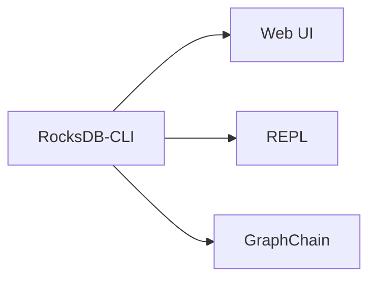

# RocksDB-CLI 文档网站生成计划

## 📋 目录
- [方案选择](#方案选择)
- [文档结构规划](#文档结构规划)
- [实施步骤](#实施步骤)
- [配置说明](#配置说明)
- [部署方案](#部署方案)
- [维护指南](#维护指南)

---

## 🎯 方案选择

### 推荐工具: MkDocs + Material for MkDocs

**选择理由:**
1. ✅ **完美适配**: 项目已有 Markdown 文档，无需转换
2. ✅ **简单快速**: 5分钟搭建，一条命令部署
3. ✅ **美观专业**: Material 主题是业界最佳文档主题之一
4. ✅ **功能丰富**: 搜索、导航、代码高亮、多语言、暗黑模式
5. ✅ **成熟稳定**: FastAPI、SQLAlchemy 等知名项目都在使用

**参考案例:**
- FastAPI 文档: https://fastapi.tiangolo.com/
- Material for MkDocs: https://squidfunk.github.io/mkdocs-material/

---

## 📁 文档结构规划

### 当前文档资源盘点

```
rocksdb-cli/
├── README.md                                    # 1160行 主文档
├── docs/
│   ├── KEY_TRANSFORMATION_EXAMPLES.md          # 410行 详细示例
│   └── MCP_SERVER_README.md                    # MCP服务器文档
├── examples/
│   ├── KEY_TRANSFORM_QUICK_START.md            # 223行 快速入门
│   └── key_transformation_demo.sh
└── scripts/transform/README.md
```

### 目标文档网站结构

```
docs/                                   # MkDocs 文档根目录
├── index.md                           # 首页 (基于 README.md)
│
├── getting-started/                   # 快速开始
│   ├── installation.md               # 安装指南
│   ├── quick-start.md                # 5分钟快速开始
│   ├── docker.md                     # Docker 使用
│   └── first-steps.md                # 第一步操作
│
├── features/                          # 核心功能
│   ├── overview.md                   # 功能概览
│   ├── web-ui.md                     # Web UI
│   ├── transform.md                  # Transform 命令
│   ├── key-transformation.md         # Key Transformation (详细)
│   ├── graphchain-ai.md              # GraphChain AI 助手
│   ├── mcp-server.md                 # MCP 服务器
│   └── search.md                     # 高级搜索
│
├── commands/                          # 命令参考
│   ├── overview.md                   # 命令概览
│   ├── repl.md                       # REPL 交互模式
│   ├── get-put.md                    # Get/Put 命令
│   ├── scan.md                       # Scan 命令
│   ├── prefix.md                     # Prefix 命令
│   ├── transform.md                  # Transform 命令
│   ├── search.md                     # Search 命令
│   ├── export.md                     # Export 命令
│   ├── stats.md                      # Stats 命令
│   └── watch.md                      # Watch 命令
│
├── guides/                            # 使用指南
│   ├── key-transformation/           # Key Transformation 指南
│   │   ├── basics.md                # 基础用法
│   │   ├── examples.md              # 实际示例
│   │   ├── advanced.md              # 高级用法
│   │   └── best-practices.md        # 最佳实践
│   ├── graphchain/                   # GraphChain 指南
│   │   ├── setup.md                 # 配置设置
│   │   ├── examples.md              # 使用示例
│   │   └── llm-providers.md         # LLM 提供商
│   └── production.md                 # 生产环境使用
│
├── api/                               # API 文档
│   ├── rest-api.md                   # REST API (Web UI)
│   ├── go-api.md                     # Go API 参考
│   └── mcp-protocol.md               # MCP 协议
│
├── examples/                          # 示例和教程
│   ├── real-world-scenarios.md       # 真实场景
│   ├── data-migration.md             # 数据迁移
│   ├── key-format-change.md          # 键格式变更
│   └── batch-processing.md           # 批量处理
│
├── development/                       # 开发者文档
│   ├── contributing.md               # 贡献指南
│   ├── architecture.md               # 架构设计
│   ├── building.md                   # 构建说明
│   ├── testing.md                    # 测试指南
│   └── release.md                    # 发布流程
│
├── reference/                         # 参考资料
│   ├── configuration.md              # 配置参考
│   ├── glossary.md                   # 术语表
│   └── troubleshooting.md            # 故障排查
│
└── about/                             # 关于
    ├── changelog.md                  # 更新日志
    ├── roadmap.md                    # 路线图
    ├── faq.md                        # 常见问题
    └── license.md                    # 许可证
```

---

## 🚀 实施步骤

### 第一阶段: 环境准备 (10分钟)

#### 1. 安装 MkDocs 和 Material 主题

```bash
# 使用 pip 安装
pip install mkdocs mkdocs-material

# 安装推荐插件
pip install \
  mkdocs-material-extensions \
  pymdown-extensions \
  mkdocs-minify-plugin \
  mkdocs-redirects

# 验证安装
mkdocs --version
```

#### 2. 初始化项目

```bash
cd /path/to/rocksdb-cli

# 创建 mkdocs.yml 配置文件
# (将在下一步详细配置)

# 创建文档目录结构
mkdir -p docs_site/{getting-started,features,commands,guides,api,examples,development,reference,about}
```

---

### 第二阶段: 文档重组 (30-60分钟)

#### 1. 创建首页 (index.md)

```bash
# 基于 README.md 创建首页，但需要优化结构
# 提取核心特性、快速开始、主要命令等
```

**首页内容结构:**
```markdown
# RocksDB-CLI

简短描述 (1-2句话)

## ✨ 核心特性

- 特性1
- 特性2
...

## 🚀 快速开始

快速安装和使用示例

## 📚 文档导航

引导到各个章节

## 🎯 使用场景

典型使用场景展示
```

#### 2. 重组现有文档

**任务清单:**

- [ ] 将 `README.md` 拆分为:
  - `index.md` (首页概览)
  - `getting-started/installation.md` (安装)
  - `getting-started/quick-start.md` (快速开始)

- [ ] 将 `KEY_TRANSFORMATION_EXAMPLES.md` 拆分为:
  - `features/key-transformation.md` (功能介绍)
  - `guides/key-transformation/basics.md` (基础用法)
  - `guides/key-transformation/examples.md` (详细示例)
  - `guides/key-transformation/advanced.md` (高级用法)
  - `guides/key-transformation/best-practices.md` (最佳实践)

- [ ] 将 `KEY_TRANSFORM_QUICK_START.md` 整合到:
  - `getting-started/quick-start.md` (部分内容)
  - `guides/key-transformation/basics.md` (基础部分)

- [ ] 移动 `MCP_SERVER_README.md` 到:
  - `features/mcp-server.md`

- [ ] 从 README 提取各命令说明创建:
  - `commands/*.md` (各个命令的详细文档)

#### 3. 补充缺失文档

**需要创建的新文档:**

```bash
# 快速开始
docs_site/getting-started/installation.md      # 详细安装说明
docs_site/getting-started/docker.md            # Docker 使用
docs_site/getting-started/first-steps.md       # 第一步操作

# 功能文档
docs_site/features/overview.md                 # 功能概览
docs_site/features/web-ui.md                   # Web UI 详细说明
docs_site/features/graphchain-ai.md            # GraphChain AI

# 参考文档
docs_site/reference/configuration.md           # 配置文件参考
docs_site/reference/troubleshooting.md         # 常见问题排查
docs_site/about/faq.md                         # FAQ

# 开发文档
docs_site/development/contributing.md          # 贡献指南
docs_site/development/architecture.md          # 架构说明
```

---

### 第三阶段: 配置 MkDocs (20分钟)

#### 创建 `mkdocs.yml` 配置文件

```yaml
# 项目信息
site_name: RocksDB-CLI
site_description: An interactive RocksDB command-line tool with AI-powered features
site_author: Your Name
site_url: https://yourusername.github.io/rocksdb-cli/

# 仓库信息
repo_name: yourusername/rocksdb-cli
repo_url: https://github.com/yourusername/rocksdb-cli
edit_uri: edit/main/docs_site/

# 版权信息
copyright: Copyright &copy; 2025 Your Name

# 主题配置
theme:
  name: material
  language: zh  # 中文界面

  # 颜色方案
  palette:
    # 亮色模式
    - scheme: default
      primary: indigo
      accent: indigo
      toggle:
        icon: material/brightness-7
        name: 切换到暗黑模式
    # 暗黑模式
    - scheme: slate
      primary: indigo
      accent: indigo
      toggle:
        icon: material/brightness-4
        name: 切换到亮色模式

  # 字体
  font:
    text: Roboto
    code: Roboto Mono

  # 功能特性
  features:
    - navigation.instant      # 即时加载
    - navigation.tracking     # 锚点跟踪
    - navigation.tabs         # 顶部标签导航
    - navigation.tabs.sticky  # 固定标签
    - navigation.sections     # 章节导航
    - navigation.expand       # 展开导航
    - navigation.indexes      # 章节索引
    - navigation.top          # 返回顶部按钮
    - search.suggest          # 搜索建议
    - search.highlight        # 搜索高亮
    - search.share            # 搜索分享
    - content.code.copy       # 代码复制按钮
    - content.code.annotate   # 代码注释
    - content.tabs.link       # 标签页链接

  # 图标
  icon:
    repo: fontawesome/brands/github
    logo: material/database

# 导航结构
nav:
  - 首页: index.md

  - 快速开始:
    - 安装指南: getting-started/installation.md
    - 5分钟快速开始: getting-started/quick-start.md
    - Docker 使用: getting-started/docker.md
    - 第一步操作: getting-started/first-steps.md

  - 核心功能:
    - 功能概览: features/overview.md
    - Web UI: features/web-ui.md
    - Transform 数据转换: features/transform.md
    - Key Transformation: features/key-transformation.md
    - GraphChain AI 助手: features/graphchain-ai.md
    - MCP 服务器: features/mcp-server.md
    - 高级搜索: features/search.md

  - 命令参考:
    - 命令概览: commands/overview.md
    - repl: commands/repl.md
    - get/put: commands/get-put.md
    - scan: commands/scan.md
    - prefix: commands/prefix.md
    - transform: commands/transform.md
    - search: commands/search.md
    - export: commands/export.md
    - stats: commands/stats.md
    - watch: commands/watch.md

  - 使用指南:
    - Key Transformation:
      - 基础用法: guides/key-transformation/basics.md
      - 实际示例: guides/key-transformation/examples.md
      - 高级用法: guides/key-transformation/advanced.md
      - 最佳实践: guides/key-transformation/best-practices.md
    - GraphChain:
      - 配置设置: guides/graphchain/setup.md
      - 使用示例: guides/graphchain/examples.md
      - LLM 提供商: guides/graphchain/llm-providers.md
    - 生产环境使用: guides/production.md

  - 示例:
    - 真实场景: examples/real-world-scenarios.md
    - 数据迁移: examples/data-migration.md
    - 键格式变更: examples/key-format-change.md
    - 批量处理: examples/batch-processing.md

  - API 文档:
    - REST API: api/rest-api.md
    - Go API: api/go-api.md
    - MCP 协议: api/mcp-protocol.md

  - 开发者:
    - 贡献指南: development/contributing.md
    - 架构设计: development/architecture.md
    - 构建说明: development/building.md
    - 测试指南: development/testing.md
    - 发布流程: development/release.md

  - 参考:
    - 配置文件: reference/configuration.md
    - 术语表: reference/glossary.md
    - 故障排查: reference/troubleshooting.md

  - 关于:
    - 更新日志: about/changelog.md
    - 路线图: about/roadmap.md
    - 常见问题: about/faq.md
    - 许可证: about/license.md

# Markdown 扩展
markdown_extensions:
  # Python Markdown 扩展
  - abbr                    # 缩写
  - admonition             # 警告框
  - attr_list              # 属性列表
  - def_list               # 定义列表
  - footnotes              # 脚注
  - meta                   # 元数据
  - md_in_html             # HTML 中的 Markdown
  - toc:                   # 目录
      permalink: true
      toc_depth: 3

  # PyMdown 扩展
  - pymdownx.arithmatex:   # 数学公式
      generic: true
  - pymdownx.betterem:     # 更好的强调
      smart_enable: all
  - pymdownx.caret         # 插入符号
  - pymdownx.details       # 详情折叠
  - pymdownx.emoji:        # Emoji
      emoji_index: !!python/name:material.extensions.emoji.twemoji
      emoji_generator: !!python/name:material.extensions.emoji.to_svg
  - pymdownx.highlight:    # 代码高亮
      anchor_linenums: true
      line_spans: __span
      pygments_lang_class: true
  - pymdownx.inlinehilite  # 行内代码高亮
  - pymdownx.keys          # 键盘按键
  - pymdownx.magiclink     # 自动链接
  - pymdownx.mark          # 标记
  - pymdownx.smartsymbols  # 智能符号
  - pymdownx.superfences:  # 超级围栏
      custom_fences:
        - name: mermaid
          class: mermaid
          format: !!python/name:pymdownx.superfences.fence_code_format
  - pymdownx.tabbed:       # 标签页
      alternate_style: true
  - pymdownx.tasklist:     # 任务列表
      custom_checkbox: true
  - pymdownx.tilde         # 删除线

# 插件
plugins:
  - search:                # 搜索
      lang:
        - zh
        - en
  - minify:                # 压缩
      minify_html: true
  - redirects:             # 重定向
      redirect_maps:
        'old-page.md': 'new-page.md'

# 额外配置
extra:
  # 社交链接
  social:
    - icon: fontawesome/brands/github
      link: https://github.com/yourusername/rocksdb-cli
    - icon: fontawesome/brands/docker
      link: https://hub.docker.com/r/yourusername/rocksdb-cli

  # 版本选择器 (可选)
  version:
    provider: mike

  # Analytics (可选)
  analytics:
    provider: google
    property: G-XXXXXXXXXX

# 额外 CSS (可选)
extra_css:
  - stylesheets/extra.css

# 额外 JavaScript (可选)
extra_javascript:
  - javascripts/extra.js
```

---

### 第四阶段: 本地预览和测试 (15分钟)

#### 1. 启动本地服务器

```bash
cd /path/to/rocksdb-cli

# 启动开发服务器 (支持热重载)
mkdocs serve

# 访问 http://127.0.0.1:8000/
```

#### 2. 测试清单

- [ ] 检查所有页面能否正常访问
- [ ] 测试搜索功能
- [ ] 检查代码高亮是否正常
- [ ] 测试导航链接
- [ ] 检查移动端显示
- [ ] 测试暗黑模式切换
- [ ] 验证代码复制按钮
- [ ] 检查图片和资源加载

---

### 第五阶段: 部署 (10分钟)

#### 方案1: GitHub Pages (推荐)

```bash
# 一条命令部署
mkdocs gh-deploy

# 自动完成:
# 1. 构建静态网站
# 2. 推送到 gh-pages 分支
# 3. 启用 GitHub Pages

# 访问: https://yourusername.github.io/rocksdb-cli/
```

#### 方案2: 使用 GitHub Actions 自动部署

创建 `.github/workflows/docs.yml`:

```yaml
name: Deploy Documentation

on:
  push:
    branches:
      - main
    paths:
      - 'docs_site/**'
      - 'mkdocs.yml'
      - '.github/workflows/docs.yml'

jobs:
  deploy:
    runs-on: ubuntu-latest
    steps:
      - uses: actions/checkout@v3

      - uses: actions/setup-python@v4
        with:
          python-version: 3.x

      - run: pip install mkdocs-material

      - run: mkdocs gh-deploy --force
```

#### 方案3: 其他平台

```bash
# Netlify
mkdocs build
# 然后上传 site/ 目录到 Netlify

# Vercel
# 配置 vercel.json 后部署

# 自己的服务器
mkdocs build
scp -r site/* user@server:/var/www/docs/
```

---

## 🎨 高级配置

### 1. 自定义样式

创建 `docs_site/stylesheets/extra.css`:

```css
/* 自定义颜色 */
:root {
  --md-primary-fg-color: #1976d2;
  --md-accent-fg-color: #ff6e40;
}

/* 代码块样式优化 */
.highlight {
  border-radius: 0.5em;
}

/* 警告框样式 */
.admonition {
  border-radius: 0.5em;
}
```

### 2. 添加自定义脚本

创建 `docs_site/javascripts/extra.js`:

```javascript
// 添加统计代码
// 添加自定义功能
```

### 3. 使用 Mermaid 图表

在 Markdown 中:

````markdown

````

### 4. 使用标签页

```markdown
=== "Python"
    ```python
    print("Hello")
    ```

=== "Bash"
    ```bash
    echo "Hello"
    ```
```

### 5. 使用警告框

```markdown
!!! note "提示"
    这是一个提示

!!! warning "警告"
    这是一个警告

!!! danger "危险"
    这是一个危险提示

!!! tip "技巧"
    这是一个技巧

!!! example "示例"
    这是一个示例
```

---

## 📊 效果预览

### 首页效果
```
╔══════════════════════════════════════════════════════════╗
║  🗄️  RocksDB-CLI                          🔍 Search    ║
╠══════════════════════════════════════════════════════════╣
║                                                          ║
║  An interactive RocksDB command-line tool                ║
║  with AI-powered features                                ║
║                                                          ║
║  ⚡ Features  📚 Docs  🚀 Quick Start  📖 Examples      ║
║                                                          ║
║  ✨ Core Features                                       ║
║  • Web UI - Modern React interface                      ║
║  • Transform - Batch data transformation                ║
║  • GraphChain - AI-powered queries                      ║
║  • Real-time monitoring                                  ║
║                                                          ║
║  🚀 Quick Start                                         ║
║  pip install rocksdb-cli                                ║
║  rocksdb-cli --db /path/to/db                           ║
║                                                          ║
╚══════════════════════════════════════════════════════════╝
```

---

## 🔧 维护指南

### 添加新文档

```bash
# 1. 在合适的目录创建 .md 文件
touch docs_site/features/new-feature.md

# 2. 编写内容

# 3. 在 mkdocs.yml 的 nav 中添加

# 4. 本地预览
mkdocs serve

# 5. 提交
git add docs_site/features/new-feature.md mkdocs.yml
git commit -m "docs: add new feature documentation"
git push
```

### 更新现有文档

```bash
# 直接编辑 .md 文件
# mkdocs serve 会自动重载
```

### 版本管理 (使用 mike)

```bash
# 安装 mike
pip install mike

# 部署版本
mike deploy v1.0 latest --update-aliases

# 列出版本
mike list

# 设置默认版本
mike set-default latest
```

---

## ✅ 检查清单

### 部署前检查

- [ ] 所有链接都能正常工作
- [ ] 代码示例都有语法高亮
- [ ] 图片都能正常显示
- [ ] 搜索功能正常
- [ ] 移动端显示正常
- [ ] 没有拼写错误
- [ ] 导航结构合理
- [ ] 有明确的行动号召 (CTA)
- [ ] 添加了 Google Analytics (可选)
- [ ] 配置了自定义域名 (可选)

### SEO 优化

- [ ] 每个页面都有描述性标题
- [ ] 添加了 meta 描述
- [ ] 使用了合适的标题层级 (H1-H6)
- [ ] 添加了 alt 文本到图片
- [ ] 创建了 sitemap.xml (MkDocs 自动生成)

---

## 📚 参考资源

- MkDocs 官方文档: https://www.mkdocs.org/
- Material for MkDocs: https://squidfunk.github.io/mkdocs-material/
- PyMdown Extensions: https://facelessuser.github.io/pymdown-extensions/
- 示例项目:
  - FastAPI: https://fastapi.tiangolo.com/
  - SQLAlchemy: https://docs.sqlalchemy.org/
  - Pydantic: https://docs.pydantic.dev/

---

## 🎯 总结

**时间投入估算:**
- 环境准备: 10分钟
- 文档重组: 30-60分钟
- 配置 MkDocs: 20分钟
- 测试调试: 15分钟
- 部署: 10分钟

**总计: 1.5-2小时即可完成！**

**收益:**
- ✅ 专业的文档网站
- ✅ 更好的用户体验
- ✅ 便于维护和更新
- ✅ SEO 优化
- ✅ 多端适配
- ✅ 版本管理

**下一步:**
1. 按照计划执行
2. 持续优化文档内容
3. 收集用户反馈
4. 定期更新维护
