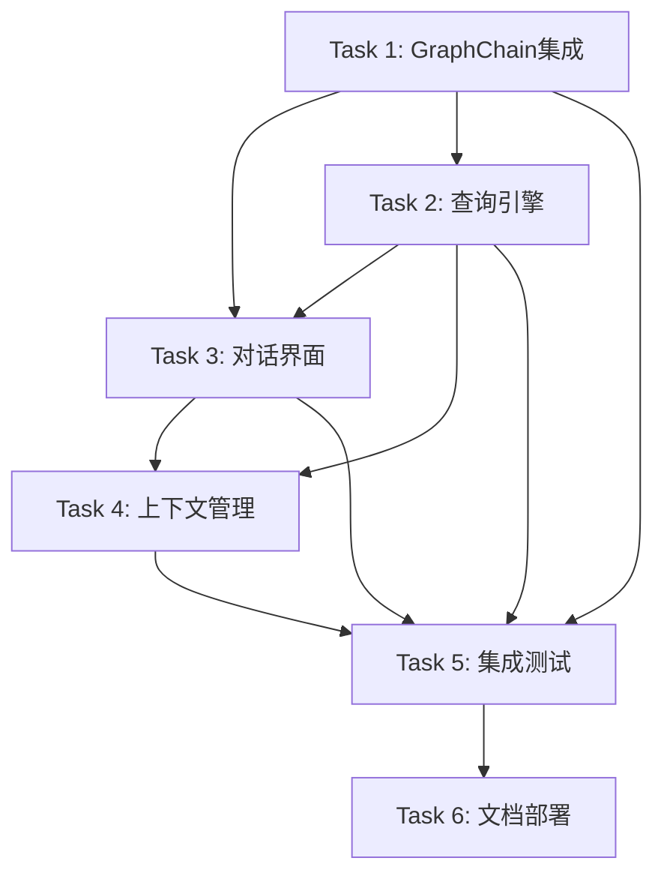
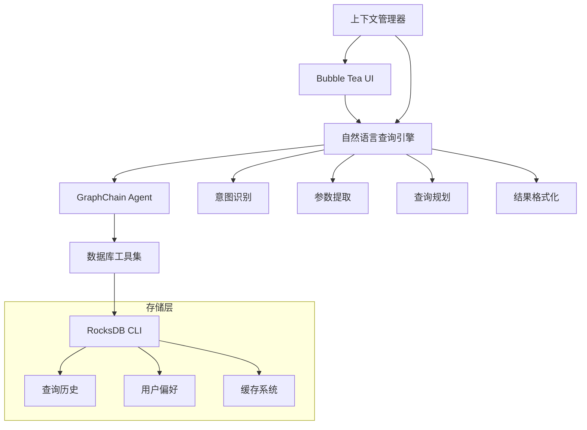

# GraphChain + RocksDB CLI 自然语言查询项目概览

## 项目描述 (Project Description)

本项目旨在为现有的 RocksDB CLI 工具集成 GraphChain AI Agent 和自然语言处理能力，让用户可以通过自然语言查询数据库，而无需学习复杂的数据库命令语法。

## 目标愿景 (Project Vision)

**"让数据库查询像日常对话一样简单自然"**

- 用户只需用中文或英文提问，AI 会自动理解意图并执行相应的数据库操作
- 提供聊天机器人式的交互体验，支持上下文对话和智能推荐
- 保持与现有 RocksDB CLI 的完全兼容性，渐进式升级用户体验

## 核心功能特性 (Core Features)

### 🤖 智能查询理解
- 自然语言意图识别和参数提取
- 支持中英文混合查询
- 智能查询优化和建议

### 💬 对话式交互界面
- 基于 Bubble Tea 的现代化 TUI 界面
- 实时响应显示和流式结果展示
- 多主题支持和个性化配置

### 🧠 上下文感知与学习
- 对话历史记录和上下文推理
- 用户行为模式学习
- 智能推荐和自动完成

### 🔧 GraphChain 集成
- LLM 驱动的查询规划和执行
- 丰富的数据库工具注册
- 安全的 Agent 操作框架

## 任务分解 (Task Breakdown)

### 📋 任务概览

| 任务 | 名称 | 优先级 | 预估工时 | 状态 |
|------|------|--------|----------|------|
| Task 1 | GraphChain Agent 集成 | 高 | 16-20h | 📋 计划中 |
| Task 2 | 自然语言查询引擎 | 高 | 20-24h | 📋 计划中 |
| Task 3 | 对话式用户界面 | 中 | 18-22h | 📋 计划中 |
| Task 4 | 上下文管理系统 | 中 | 14-18h | 📋 计划中 |
| Task 5 | 集成与测试 | 高 | 16-20h | 📋 计划中 |
| Task 6 | 文档与部署 | 中 | 12-16h | 📋 计划中 |

**总预估工时**: 96-120 小时 (约 4-6 周，1-2 名开发者)

### 🔄 任务依赖关系

### 📊 里程碑规划

#### 🎯 里程碑 1: 基础架构 (Week 1-2)
- **目标**: 完成 GraphChain 集成和查询引擎核心功能
- **交付物**: 
  - 可工作的 GraphChain Agent
  - 基础自然语言查询处理
  - 核心接口定义
- **验收标准**: 能够处理简单的自然语言查询

#### 🎯 里程碑 2: 用户界面 (Week 3-4)
- **目标**: 完成对话界面和上下文管理
- **交付物**:
  - 功能完整的 TUI 界面
  - 对话历史和上下文系统
  - 用户偏好学习机制
- **验收标准**: 提供流畅的对话式查询体验

#### 🎯 里程碑 3: 系统完善 (Week 5-6)
- **目标**: 系统集成、测试和发布准备
- **交付物**:
  - 完整的端到端测试
  - 部署配置和文档
  - 发布包和安装程序
- **验收标准**: 系统稳定可靠，可投入生产使用

## 技术架构 (Technical Architecture)

### 🏗️ 系统架构图

### 🔧 核心组件

1. **GraphChain Agent**: LLM 驱动的智能查询处理
2. **自然语言引擎**: 意图识别和查询转换
3. **对话界面**: 现代化的 TUI 交互体验
4. **上下文管理**: 智能的对话历史和学习系统
5. **工具集成**: 安全的数据库操作封装

### 📚 技术栈

- **编程语言**: Go 1.22+
- **UI 框架**: Bubble Tea + Lip Gloss
- **AI 集成**: GraphChain + OpenAI/Anthropic APIs
- **数据库**: RocksDB (现有)
- **测试**: Go testing + Testify
- **部署**: Docker + Docker Compose

## 预期收益 (Expected Benefits)

### 👥 用户价值
- **降低学习成本**: 无需学习数据库命令语法
- **提高查询效率**: 自然语言比命令行更直观
- **智能化体验**: AI 驱动的推荐和优化建议
- **个性化服务**: 学习用户习惯，提供定制化体验

### 🔧 技术价值
- **架构现代化**: 引入 AI 和现代 UI 技术
- **扩展性增强**: 为未来 AI 功能奠定基础
- **用户体验提升**: 从 CLI 升级到对话式界面
- **开源贡献**: 推动 RocksDB 生态系统发展

### 📈 商业价值
- **差异化竞争**: 在 NoSQL 工具中独树一帜
- **用户增长**: 吸引更多非技术用户
- **生态建设**: 促进 RocksDB 社区发展
- **技术品牌**: 展示 AI + 数据库结合的创新

## 风险管控 (Risk Management)

### ⚠️ 主要风险

1. **技术风险**:
   - GraphChain SDK 稳定性问题
   - 自然语言理解准确性挑战
   - 性能和资源消耗问题

2. **项目风险**:
   - 开发周期可能延长
   - 用户接受度不确定
   - 与现有系统集成复杂

3. **外部风险**:
   - LLM API 服务依赖
   - 开源协议兼容性
   - 竞争产品出现

### 🛡️ 缓解策略

- **技术方案**: 多方案备选，渐进式实现
- **质量保证**: 完善的测试体系和质量门禁
- **用户验证**: 早期用户测试和反馈收集
- **风险监控**: 定期风险评估和应对调整

## 成功指标 (Success Metrics)

### 📊 定量指标
- 自然语言查询准确率 ≥ 90%
- 系统响应时间 < 2秒（简单查询）
- 用户满意度评分 ≥ 4.0/5.0
- 代码测试覆盖率 ≥ 80%
- 新用户上手时间 < 10分钟

### 📈 定性指标
- 用户反馈积极正面
- 开源社区认可和采用
- 技术创新度和影响力
- 团队能力提升和成长

## 后续发展 (Future Roadmap)

### 🚀 短期规划 (6个月内)
- 完善核心功能，修复用户反馈的问题
- 支持更多复杂查询场景
- 增加更多 LLM 后端选择
- 完善多语言支持

### 🌟 中期规划 (1年内)
- 集成机器学习模型进行查询优化
- 支持其他 NoSQL 数据库
- 开发 Web 版本和 API 服务
- 建立插件生态系统

### 🔮 长期愿景 (2年内)
- 成为 NoSQL 数据库的标准 AI 接口
- 支持复杂的数据分析和报表生成
- 集成到主流数据平台和工具链
- 推动数据库查询界面的革命性变化

---

**项目启动时间**: 2024年当前
**预期完成时间**: 4-6周后
**项目负责人**: [待定]
**技术团队**: 1-2名开发者

> 💡 **注意**: 本项目采用敏捷开发方式，支持快速迭代和用户反馈驱动的改进。每个里程碑都包含可演示的功能增量，确保项目价值的及时体现。 